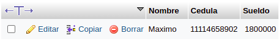
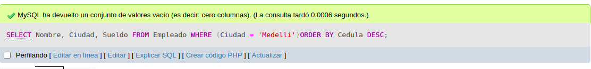
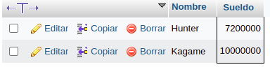
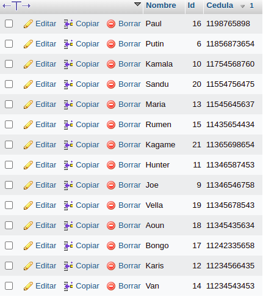
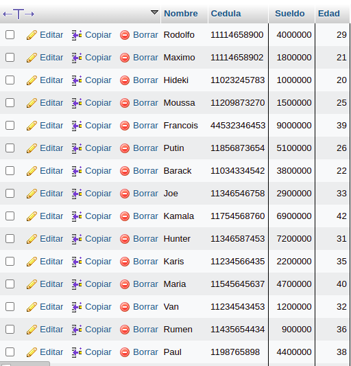
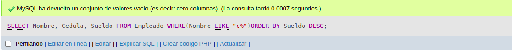

1. Traer el nombre cedula y salario de un empleado ordenando los campos de la siguiente manera: Ascendente por  nombre y descendente por cedula

`SELECT NOMBRE, CEDULA, SUELDO FROM EMPLEADOS WHERE (CIUDAD = 'MEDELLIN')ORDER BY NOMBRE`

`SELECT NOMBRE, CEDULA, SUELDO FROM EMPLEADOS WHERE (CIUDAD = 'MEDELLIN')ORDER BY CEDULA DESC`

2. Traer el nombre y salario de los primeros 25 empleados cuyo sualedo es mayor de $600000 ordenandolos en forma ascendente por el numero de cedula 

`SELECT TOP 25 NOMBRE, SUELDO FROM EMPLEADOS WHERE (SUELDO>6000000)ORDER BY CEDULA`

3. Mostrar el nombre, id y cedula de los primeros 15 empleados cuyos nombres sean distintos orden la consulta en forma descendente por cedula

`SELECT DISTINCT TOP 15 NOMBRE,ID,CEDULA FROM EMPLEADOS ORDER BY CEDULA DESC`

4. Entregar los primeros 15 empleados con nombre y cedula cuya ciudad sea BOGOTA se necesita que los encabezados de las columnas tengan los siguientes titulos

a. Para el campo NOMBRE-------RAZON SOCIAL
b. Para el campo CEDULA-------IDENTIFICACION 
c. Ordene la lista en forma descendente por cedula 

`SELECT TOP 15 NOMBRE AS "RAZON SOCIAL", CEDULA AS "IDENTIFICACION" FROM EMPLEADOS WHERE (CIUDAD = 'BOGOTA')ORDER BY CEDULA DESC`

5. Realizar una consulta que entregue el nombre identificacion sueldo edad de los empleados cuyos sueldos esten entre $8000000 y $12000000 y cuyas edades esten entre los 23 y 30 años

`SELECT NOMBRE, CEDULA, SUELDO, EDAD FROM EMPLEADOS WHERE (SUELDO BETWEEN 8000000 AND 12000000 AND EDAD BETWEEN 23 AND 30`

6. Realizar una consulta que muestre nombre cedula y salario de los empleados cuyo nombre comience por la letra c ordene esta lista por salario en forma descencente

`SELECT NOMBRE, CEDULA, SUELDO FROM EMPLEADOS WHERE (NOMBRE LIKE 'C%')ORDER BY SUELDO DESC`

